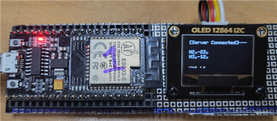
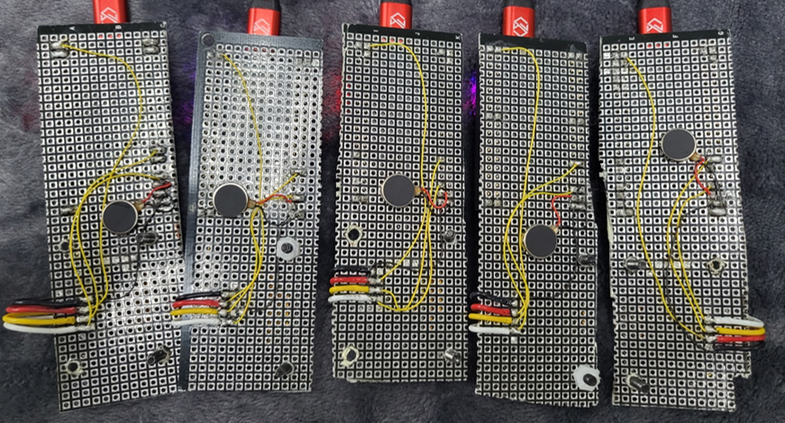

# Capstone_ESP32_NodeJS_EJS
#### 한양대 ERICA 전자공학부 17학번 저의 졸업작품 입니다.

본 과제가 목표하는 하드웨어 및 소프트웨어 시스템 구조는 다음과 같다. 
  1. 6개의 ESP32를 이용해 ServerNode와 ClientNode를 정해 Mesh-Network 환경을 만든다. 
  2. 구축된 환경으로부터 각 ClientNode 사이 거리를 RSSI 값을 이용해 상대적 포지션을 추정한다.
  3. Node.js와 Express.js로 Bootstrap과 JQuery를 활용해 홈페이지를 구현한다. 
      3-1. a와 b로부터 얻어낸 Node 데이터를 시각화한다.
  4. 서로 가까운 Node를 잡아내 사회적 거리두기에 준하는 거리만큼 떨어지도록 유도한다.  
      4-1. 거리두기 유도 방법으로 진동 모터, LED, 부저 등을 활용한다.
 ---
 
 6개의 ESP32 개발보드를 활용해 6개의 WiFi AccessPoint를 만들면 ServerNode 1개, ClientNode 5개로 ClientNode는 주변의 다른 ClientNode 신호를 스캔해 RSSI값을 모두 저장한다.   
  이는 다시 배열 또는 문자열로 저장해 ServerNode로 한번에 데이터(Client data)를 보낸다.   
  ClientNode 5개와 각각 주변 RSSI 값 4개씩 총 20개의 Client DataSet이 ServerNode로 들어온다.  
  그러면 다시 ServerNode에서 문자열 파싱을 거쳐 데이터를 분석한다.   
  Node.JS와 통신을 하기위해 필요한 정보만 필터링해 데이터를 Express.JS를 활용해 HTTP 웹사이트 위에 동적으로 POST 한다.   
  시각화된 웹사이트 데이터를 기반으로 거리가 가까운 노드를 지적하는 알림창이 뜬다.  

--- 
### 사용한 언어 및 라이브러리, 프로그램
* ESP32
  * WiFi
  * PainlessMesh
  * SSD1306 (OLED)
* Node.JS
  * Express.JS
  * HTML/CSS/BootStrap
  * JavaScript
* EasyEDA
  * ESP32 Socket
  * OLED Socket
  * Li-PO Battery Charger Circuit
  * Li-Po Battery Protection Circuit

---
### System Structure

---
### Completion Work

#### PCB & Universal Board 
PCB 발주를 넣었는데 3주 동안 배송 연기되서 작품에는 반영되지 못한..ㅠㅠ
 

 

#### Node OLED
Client 노드에만 OLED가 달려있음 -> 서버노드는 어차피 노트북이랑 연결되있어서 
Connected State (Server -O- Client) 
 
Stand By (Server -x- Client) 
 
만능기판 뒷면

#### Web Page

 

#### Nodes
Client Node 5개와 Server Node 1개 

1. ClientNode는 근처에 다른 ClientNode가 가까워지는 것을 감지해내면 진동모터로 알림이 울린다.
2. ClientNode는 식별된 주변 ClientNode까지의 거리 데이터를 ServerNode로 보낸다.
3. ServerNode는 5개의 ClientNode로부터 받은 데이터를 파싱해 수집 및 정리한다.
4. 정리된 데이터는 Node.JS 서버와 통신을 통해 웹 사이트에서 갱신된다.
5. 데이터 정보는 Express.JS로 넘어가 실시간 노드 정보를 시각화하여 확인할 수 있다.
 5-1. 가까운 노드는 빨간색 표시가 뜨고 아래 가까운 노드 정보를 표시해주며 알림이 울린다.
 5-2. 아직 연결이 안된 Node는 배경이 빨간색으로 표시되면 반대로 연결된 경우는 초록색이다.
          
          
          
